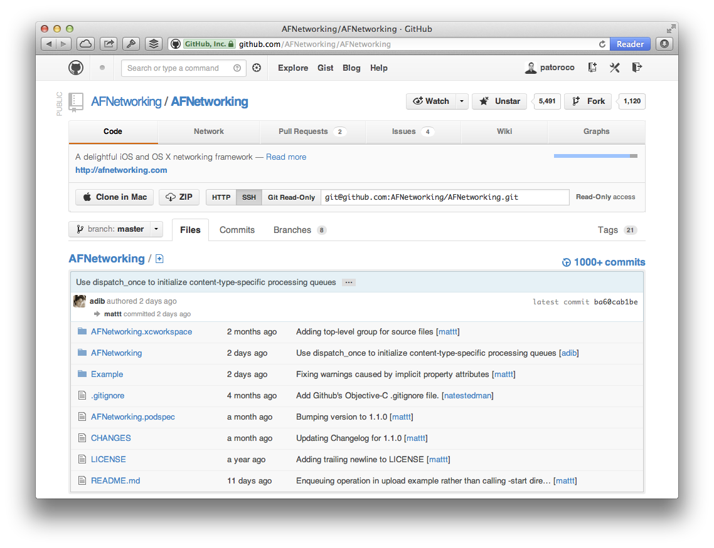

## 1.1. Where can I buy AFNetworking framework?

AFNetworking is hosted in **GitHub**, an online project hosting based on **git SCM** (Source Code Management).

If you didn’t know GitHub, believe me, you’ll love it. Why? A lot of developers are sharing their projects here so you can browse their sources (that’s the best part) totally free!

To get AFNetworking framework, you can go to GitHub’s project page [https://github.com/AFNetworking/AFNetworking](https://github.com/AFNetworking/AFNetworking) and download it directly from here (see image).

You also could fork the project to your GitHub account, but that is out of scope of this book, so if you are interested in I suggest that you search a specialized git book and learn to use it because it’s very useful for develop both alone and when you work with others.