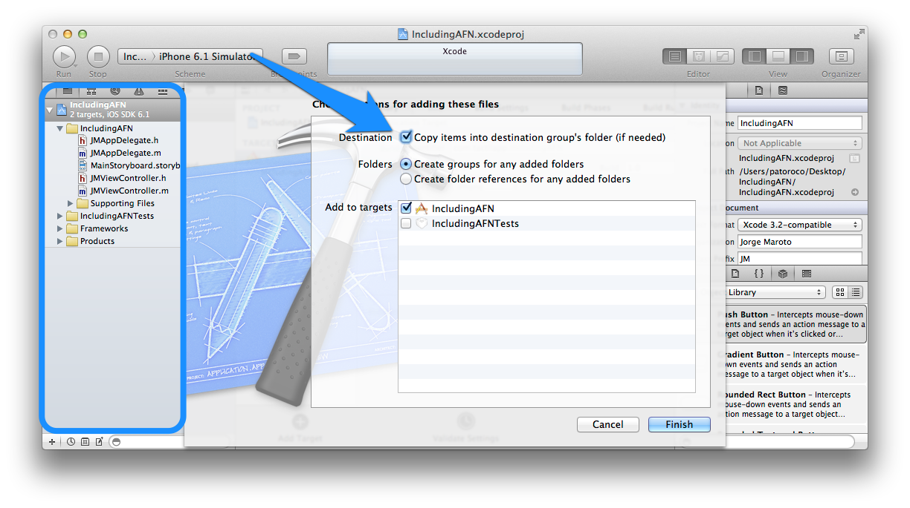
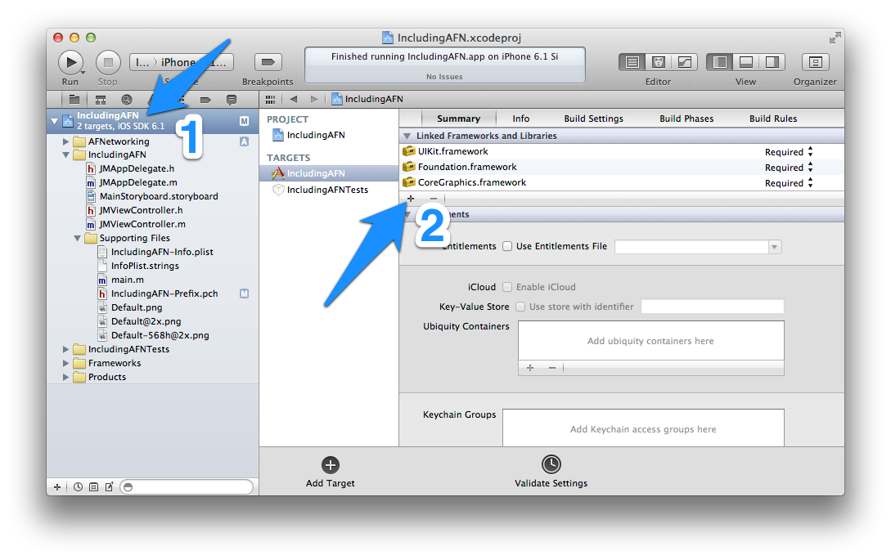

## 1.2. Installing from the source

At the top of GitHub you will see a `ZIP` button, clicking it you’ll obtain last release of AFNetworking’s source compressed in a `.zip` file (you can download it from [https://github.com/AFNetworking/AFNetworking/archive/master.zip](https://github.com/AFNetworking/AFNetworking/archive/master.zip) directly). You'll need to double click on it to uncompress.

The folder that you will have obtained has the following structure:

* AFNetworking folder.
* *AFNetworking.xcworkspace* file.
* Example folder.
* Some other files which aren’t interesting at the moment.

If you are an early adopter, you can open *AFNetworking.xcworkspace*, and you’ll see two application examples, one for OS X and another for iOS. Feel free to try each one, but the rest of this book will focus on iOS version, and when you have played enough with the examples, we go to include AFNetworking in our project.

For this, you need to create a new project (or use your current project), and drop AFNetworking subfolder to XCode Project Navigator (circled area on image below). When a dialog appears, don’t forget to choose `Copy items` to put the files inside your project as you can see pointed with the arrow as follows:



If you try to run it at this moment, you’ll receive a warning from the compiler. This is because you need to add some SDK frameworks to your project before continuing, so here we go!


### 1.2.1. Adding the required frameworks

On the Project Navigator, click on your project file (1 on the image) and choosing summary tab scroll to `Linked Frameworks and Libraries` section, where you need to click on plus to add *MobileCoreServices.framework* and *SystemConfiguration.framework* from the list that will appear.



Only one more thing, you need to add both frameworks to precompiled headers, so in the Project Navigator look for a file with `.pch` extension and open it (usually it’s under a `Supporting Files` folder). You need to add two lines between `#ifdef macro`. Final result should be anything like the following:

```obj-c
#ifdef __OBJC__
    #import <UIKit/UIKit.h>
    #import <Foundation/Foundation.h>
    #import <SystemConfiguration/SystemConfiguration.h>
    #import <MobileCoreServices/MobileCoreServices.h>
#endif
```

That’s all! You can run it now, and if all was ok you should have a white screen in front of you. Don’t worry, in the chapter 2 we’ll add some functionality to your killer-app :).