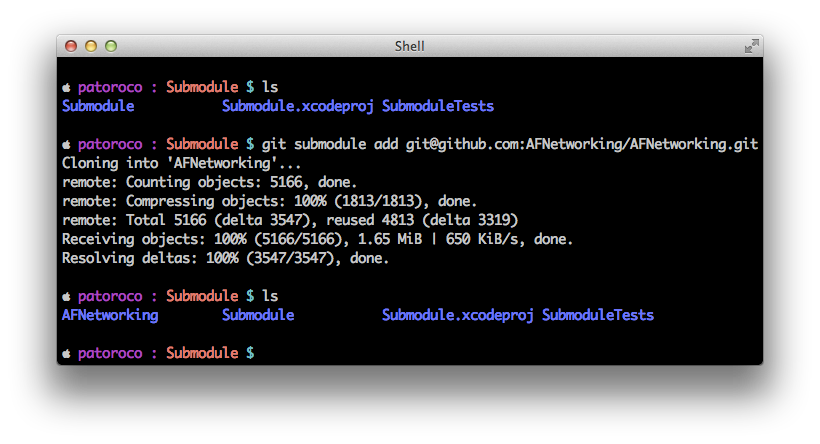

## 1.3. Include AFNetworking as git submodule

One of the advantages of using GitHub instead of hosting your files on a common web is that you’ll be notified of updates on real-time. That means that any feature, which is added by the library’s author, could be downloaded just at this moment. Awesome, isn’t it?  

Using the first way to include AFNetworking in your project (downloading a static `.zip` file) will make you lose this functionality, so in this subsection we’ll learn how to include full git repo on our project and how to continue receiving new features when AFN’s contributors update it.  

In the first place, we’ll need to have installed git on our system. The easiest way is using Components Download Dialog on XCode, so we can go to `XCode Menu | Preferences | Downloads` and choose Download the `Command Line Tools`.  

Once installed, you can go to your project’s folder and clone git repo executing:
  

```bash
git submodule add git@github.com:AFNetworking/AFNetworking.git  
```

Now you can see a new folder *AFNetworking* in root project folder, that’s the last commit on AFNetworking’s repo.


  


Now, you can follow the same process that you learned in the first section of this chapter, installing from the source with these files. The only thing that you need to be aware of is deselecting `Copy Items` check on the dialog, because you already have these files in your project folder.  

 > AFNetworking project includes some examples that aren't required in our project, so you only need include folder with framework’s classes inside of this.
 
Easy, isn’t it? Now we’ll see an even simpler method for adding AFNetworking to a project.