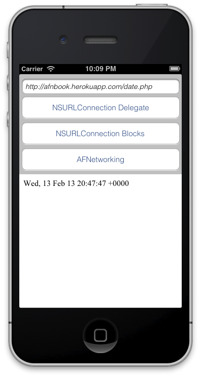

## 2.1. Building the skeleton of our application

We will work during the entire chapter on the same application, which will show the content of a file available on Internet. For this purpose we’ll learn how did this task before AFNetworking, and finally we’ll show how easy it is using this awesome library.  

As you can see in following figure, the layout is very simple: that’s only a textfield for introduction to the URL of the request, a webview, where we’ll load the results and three options to do request using each method explained below.  

  

For convenience variable names in the rest of this chapter, you can copy following IBOutlets variable names.

```obj-c
@interface JMViewController ()
	@property (weak, nonatomic) IBOutlet UITextField *urlField;
	@property (weak, nonatomic) IBOutlet UIWebView *webView;
@end
```

We also deploy some server-side scripts to take as example for the book. Often they are very simple, but if you are curious, you can find them on Github ([https://github.com/patoroco/AFNBook_Server](https://github.com/patoroco/AFNBook_Server)).  

In this chapter we use a simple script written in PHP to show the current datetime ([http://afnbook.herokuapp.com/date.php](http://afnbook.herokuapp.com/date.php)), so it’s better to set this URL as default on `viewDidLoad` method.  

```obj-c
@implementation JMViewController
- (void)viewDidLoad{
	NSString * const sampleURL = @"http://afnbook.herokuapp.com/date.php";
	self.urlField.text = sampleURL;  
	[super viewDidLoad];
}
@end
```  

We suppose that you don’t have any trouble until now; anyway, if you find any problem following this (or others) chapters, remember that you have all the samples of this book in a Github repository ([https://github.com/patoroco/AFNBook_Samples](https://github.com/patoroco/AFNBook_Samples)), so feel free to use it when you need.  

That’s all your layout needs, so go ahead and add some functionality to this empty app.