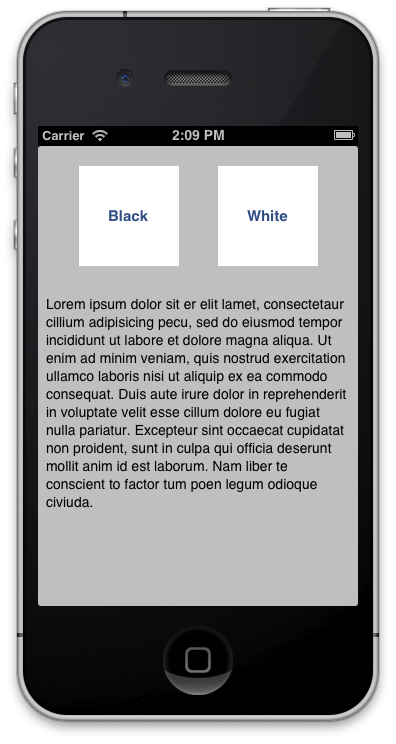

### 3.2.1. Squeleton of Configurations

The first step is to create a new XCode project that we’ll name Configurations. In this case we use a `Single View Application` template, and include two buttons and one textview where a typical *‘lorem ipsum’* appears written by default, that’s enough to test the behavior of our configurations. Final result should be something like following figure:  

  

As we will to change some properties of these components (color, font, etc.), it’s required that you connect these with IBOutlets to your class as follows:  

```obj-c
@interface JMViewController ()  
	@property (weak, nonatomic) IBOutlet UITextView *textView;  
    @property (weak, nonatomic) IBOutlet UIButton *buttonBlack;  
	@property (weak, nonatomic) IBOutlet UIButton *buttonWhite;  
@end  
```  

Now, we need to install and setup AFNetworking to run in our application. We’ll take the advantage of be using Cocoa Pods to include a helper to handle easily colors in hexadecimal format, it’s named **EDColor**. Here we go, create a `Podfile` and include on it the following lines:  

```  
platform :ios, '6.0'  
pod 'AFNetworking', '1.0'  
pod 'EDColor', '0.2'  
```  

After that, execute `pod install` and remember to open Configurations*.xcworkspace* instead of *.xcproject* file from now.  

Finally we’ll include headers on our view controller as follow:  

```obj-c  
#import <AFNetworking/AFNetworking.h>  
#import <EDColor/UIColor+Hex.h>  
```