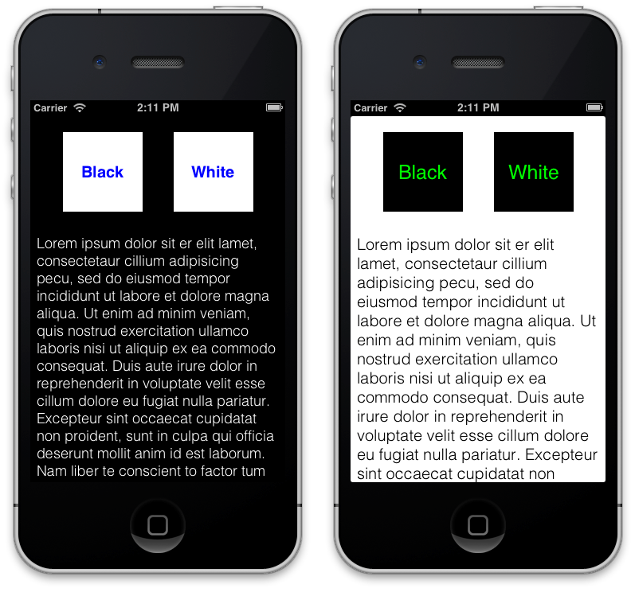

### 3.2.3. Updating the view

Once we have NSDictionary with properties that we want to change on the view, we need to update these properties. For this purpose, we going to create a method to avoid repeat code by each button as follow:  

```obj-c  

-(void)updateViewWithTheme:(NSDictionary *)config{  
    // Background  
    self.view.backgroundColor = [UIColor colorWithHexString:config[@"background"][@"color"]];  

    // Buttons  
    UIColor *buttonBC = [UIColor colorWithHexString:config[@"buttons"][@"background_color"]];  
    NSString *buttonFontFamily = config[@"buttons"][@"font"][@"family"];  
    UIColor *buttonFontColor =  [UIColor colorWithHexString:config[@"buttons"][@"font"][@"color"]];  
    CGFloat buttonFontSize = ((NSNumber *)config[@"buttons"][@"font"][@"size"]).floatValue;  
    self.buttonBlack.backgroundColor = buttonBC;  
    self.buttonBlack.titleLabel.font = [UIFont fontWithName:buttonFontFamily size:buttonFontSize];  
    self.buttonBlack.titleLabel.textColor = buttonFontColor;  
    self.buttonWhite.backgroundColor = buttonBC;  
    self.buttonWhite.titleLabel.font = [UIFont fontWithName:buttonFontFamily size:buttonFontSize];  
    self.buttonWhite.titleLabel.textColor = buttonFontColor;  

	// TextView  
    NSString *textFontFamily = config[@"textview"][@"font"][@"family"];  
    CGFloat textFontSize = ((NSNumber *)config[@"textview"][@"font"][@"size"]).floatValue;  
    UIColor *textColor = [UIColor colorWithHexString:config[@"textview"][@"font"][@"color"]];  
    self.textView.textColor = textColor;  
    self.textView.font = [UIFont fontWithName:textFontFamily size:textFontSize];  
}  
```  

That’s slice of code is very easy, you only update view attributes using values that you received on the plist file. In the case of the colors, we used UIColor category that allows us to create an *UIColor* using hexadecimal notation (i.e. `#FF0000` is red) which should be familiar to you if you developed web.  

As you can see, you can “navigate” inside of properties using their key-names, so you can use their values as you want.
Final step is to call this method from each button using theme’s URLs as following:  

```obj-c  
NSString * const blackURL = @"http://afnbook.herokuapp.com/theme_black.plist";  
NSString * const whiteURL = @"http://afnbook.herokuapp.com/theme_white.plist";  
- (IBAction)blackTheme {  
    [self loadThemeURL:blackURL];  
}  
- (IBAction)whiteTheme {  
    [self loadThemeURL:whiteURL];  
}  
```  

If you run the app and press buttons, colors and fonts should be change and looks like below image:  

  

That was all! You have learned an interesting method to load properties dynamically in your application. In the next section, you’ll learn how to manage more complex XML files that allowing you to load info to your app.
