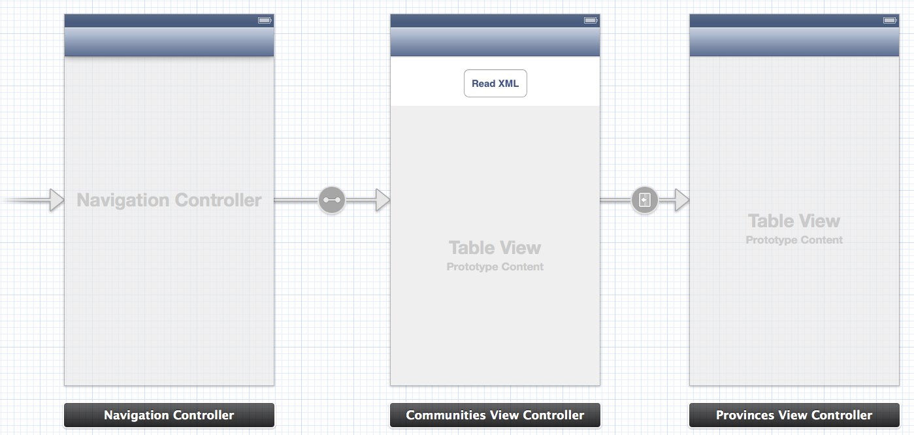

### 3.3.1. Squeleton of Comunities  

Two view controllers will compose this app: a table with communities and a table with provinces. Due to that, we'll use storyboard to simplify process, as can be see in image below: 
 
  

We only create two UIViewController subclasses and include one UITableView in each. Also include a button on communities view controller that will start XML request. Don’t forget to link tables with each class using an IBOutlet as is usual.