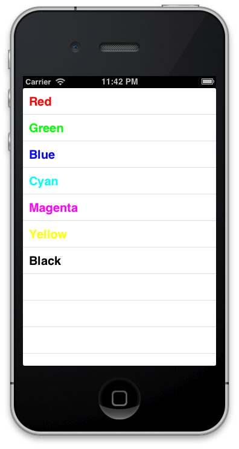

## 3.4. JSON  

JSON has become very popular due to file size saving compared with XML. Is for this that all of popular APIs allow to use JSON as data structure.  
  
For understand how `AFJSONRequestOperation` class works, we will load a simple file that contains color names and hexadecimal value, and we’ll show each text in a table of its color. This file can be found using this URL [http://afnbook.herokuapp.com/colors.json](http://afnbook.herokuapp.com/colors.json).  
  
### 3.4.1. Squeleton of Colors  

First of all we create a single view application, and using Cocoa Pods to install `AFNetworking` and `EDColor` that will help us to manage colors in our applications. For that purpouse we need a Podfile like the following:  
  
```  
platform :ios, '6.0'  
pod 'AFNetworking', '1.0'  
pod 'EDColor', '0.2'  
```  
  
As usual, run pod install and open workspace instead of project file from now.  
  
Now, add a tableview to our view controller and connect it with an IBOutlet. Set the **delegate** and **datasource** to this class, and add a property of type NSArray that save all our colors as follows:  
  
```obj-c  
@interface JMViewController ()  
	@property (weak, nonatomic) IBOutlet UITableView *tableColors;  
	@property (strong, nonatomic) NSArray *colors;  
@end  
```  
  
After that, we’ll create operation to do request, in this case using a specific subclass for JSON as you can see bellow:  
  
```obj-c  
NSString * const colorsURL = @"http://afnbook.herokuapp.com/colors.json";  
  
- (void)viewDidLoad{  
	[super viewDidLoad];  
  
	NSURL *url = [NSURL URLWithString:colorsURL];  
	NSURLRequest *request = [NSURLRequest requestWithURL:url];  
	AFJSONRequestOperation *operation = [AFJSONRequestOperation  
		JSONRequestOperationWithRequest:request  
		success:^(NSURLRequest *request, NSHTTPURLResponse *response, id JSON) {  
			self.colors = ((NSDictionary *)JSON)[@"colorsArray"];  
			[self.tableColors reloadData];  
		}  
		failure:^(NSURLRequest *request, NSHTTPURLResponse *response, NSError *error, id JSON) {  
			NSLog(@"%@", error.localizedDescription);  
		}];  
		[operation start];  
}  
```  
  
Thanks to AFNetworking, manage a JSON response is a kids play because it returns a NSDictionary with values, so we only need to get array of color codes, an save it on our property. After that, we call to reload data method that need delegate methods implementation as follows:  
  
```obj-c  
#pragma mark - Table Delegates  
-(NSInteger)tableView:(UITableView *)tableView numberOfRowsInSection:(NSInteger)section{  
	return self.colors.count;  
}  
  
- (UITableViewCell *)tableView:(UITableView *)tableView cellForRowAtIndexPath:(NSIndexPath *)indexPath{  
	…  
	cell.textLabel.text = self.colors[indexPath.row][@"colorName"];  
	cell.textLabel.textColor = [UIColor colorWithHexString:self.colors[indexPath.row][@"hexValue"]];  
	return cell;  
}  
```  
  
As you saw, you only need to use key values as is usual, and using EDColor category, turn in NSString to UIColors.
If you run the application now, you’ll see any like image bellow, magical!  
  
