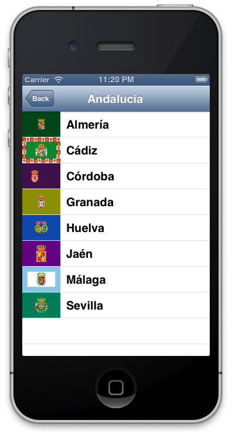

## 3.5. Loading images asynchronously  

One of the most useful categories that I know on Objective-C is included on AFNetworking. This is used to load images on UIImageView asynchronously without worrying about hard delegates and allowing set a placeholder to show while full image is loaded.  

Open Communities XML project, and we’ll extend it loading each flag of province or community. You only need to include category on the header of your view controllers as follows:  
  
```obj-c  
#import "UIImageView+AFNetworking.h"  
```  
  
After that, it’s easy call to the method `setImageWithURL:placeholderImage:` which is included in this category.  
  
```obj-c  
// Community view controller  
[cell.imageView  
	setImageWithURL:[NSURL URLWithString:comunity.image]  
	placeholderImage:[UIImage imageNamed:@"placeholder.png"]  
];  
  
// Province view controller  
[cell.imageView  
	setImageWithURL:[NSURL URLWithString:province.image]  
	placeholderImage:[UIImage imageNamed:@"placeholder.png"]  
];  
```  

 > You can use placeholder.png image that is included in source of this book.  
  
Run the application, and enjoy how are loading images in each cell of the tables as image bellow.  
  
