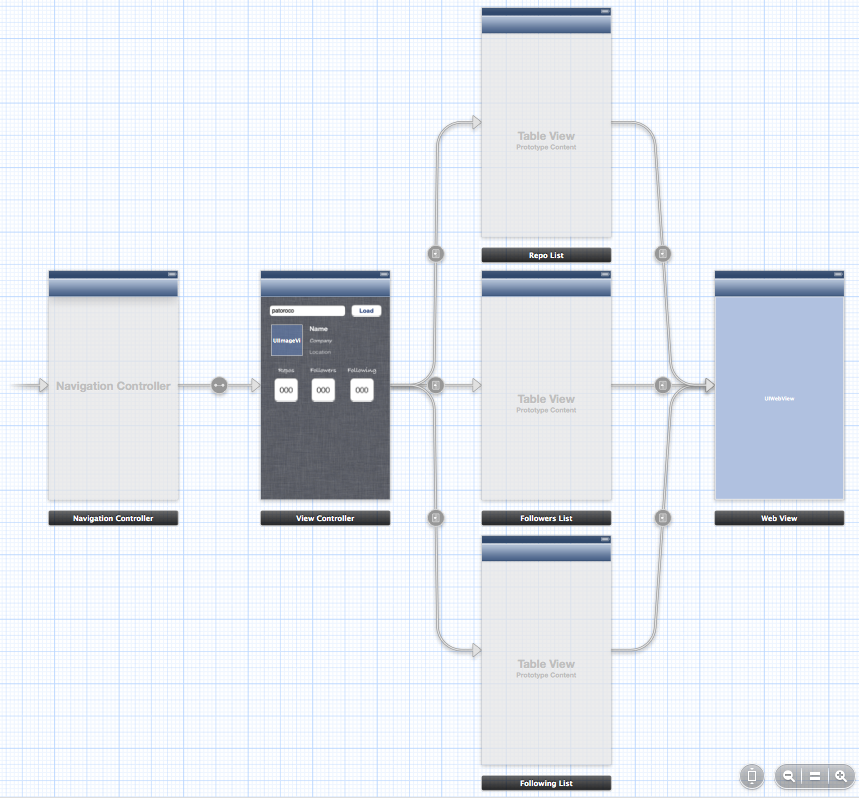

### 4.1.3 Skeleton of GitApp  

In this case we going to create a multi viewcontroller application, so I prefer to use storyboard for it. This is the final aspect that you would accomplish if you follow this chapter.  
  
  
  
As you can see, application is built with a navigation controller, where root view controller shows a text field to introduce a GitHub nickname and pressing load, it will do a request to GitHub API returning all specific values to fill this screen.  
  
After that, user could select see user repositories, people who is followed by this user or people that is following the user.  
  
Finally, we’ll use GitHub URL included on response to show webpage of each to the user.  
  
As we did before, we need to include AFNetworking in our project, so one more time I chosen the easiest method: CocoaPods. If you have some dudes, go back and reread this section.