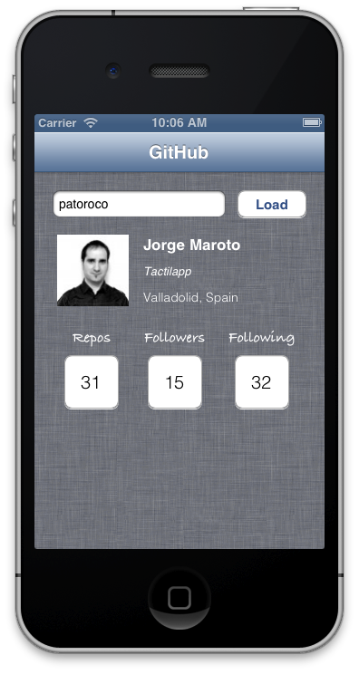

### 4.1.5 User info  
  
Main screen shows some information about user whit the nickname filled on text field, as user avatar, real name or number of friends of this user as you can see on image below.  
  
  
  
First of all, we need to define some outlets to update these interface elements, as follows:  
  
```obj-c  
@interface JMViewController ()  
	@property (weak, nonatomic) IBOutlet UITextField *nickname;  
	@property (weak, nonatomic) IBOutlet UIImageView *avatar;  
	@property (weak, nonatomic) IBOutlet UILabel *name;  
	@property (weak, nonatomic) IBOutlet UILabel *company;  
	@property (weak, nonatomic) IBOutlet UILabel *location;  
	@property (weak, nonatomic) IBOutlet UIButton *reposButton;  
	@property (weak, nonatomic) IBOutlet UIButton *followersButton;  
	@property (weak, nonatomic) IBOutlet UIButton *followingButton;  
@end  
```  
  
After that we need to include an IBAction which will be called when load button will be pressed and will start the API request.  
  
```obj-c  
- (IBAction)loadUser {  
	NSString *urlWithUser = [NSString stringWithFormat:@"users/%@", self.nickname.text];  
	
	[[JMGitHubAPIClient sharedClient]  
		getPath:urlWithUser  
		parameters:nil  
		success:^(AFHTTPRequestOperation *operation, id responseObject) {  
			[self loadInfo:responseObject];  
		} failure:^(AFHTTPRequestOperation *operation, NSError *error) {  
			NSLog(@"Error:\n%@", error.localizedDescription);  
		}
	];  
}  
```  
  
As you can see, here we are using our `AFHTTPClient subclass`, adding relative path to specify what we want to do, in this case we are calling to *users/&lt;nickname&gt;* to get information relative to this user.  
  
On success we call to `loadInfo` method that is responsible to manage all information and include it in our labels, buttons or whatever as follows.  
  
```obj-c  
-(void)loadInfo:(NSDictionary *)responseDict{  
	[self.avatar setImageWithURL:[NSURL URLWithString:responseDict[@"avatar_url"]]];  
	self.name.text = responseDict[@"name"];  
	self.company.text = responseDict[@"company"];  
	self.location.text = responseDict[@"location"];  

	NSString *repoStr = [NSString stringWithFormat:@"%@", responseDict[@"public_repos"]];  
	NSString *followingStr = [NSString stringWithFormat:@"%@", responseDict[@"following"]];  
	NSString *followersStr = [NSString stringWithFormat:@"%@", responseDict[@"followers"]];  

	[self.reposButton setTitle:repoStr forState:UIControlStateNormal];  
	[self.followingButton setTitle:followingStr forState:UIControlStateNormal];  
	[self.followersButton setTitle:followersStr forState:UIControlStateNormal];  
}
```  
 
As you can see, **JSON** is converted to an `NSDictionary`, so it’s easy to access to every key value, so one more time my advice is that open the full JSON in your favourite text editor and select fields that you need to show on the screen.  
  
Finally we need to include IBOutlets for each button that will load follower users, following users and repositories and prepareSegue for the next view controller that depends of the name of the user.  
  
```obj-c  
- (IBAction)loadRepos {  
    [self performSegueWithIdentifier:kRepoSegue sender:self];  
}  
- (IBAction)loadFollowers {  
    [self performSegueWithIdentifier:kFollowersSegue sender:self];  
}  
- (IBAction)loadFollowing {  
    [self performSegueWithIdentifier:kFollowingSegue sender:self];  
}  
  
-(void)prepareForSegue:(UIStoryboardSegue *)segue sender:(id)sender{  
    if ([segue.identifier isEqualToString:kRepoSegue]){  
        JMRepoList *repoList = segue.destinationViewController;  
        repoList.title = @"Repositories";  
        repoList.nickname = self.nickname.text;  
    }else if ([segue.identifier isEqualToString:kFollowersSegue]){  
        JMFollowersList *followersList = segue.destinationViewController;  
        followersList.title = @"Followers";  
        followersList.nickname = self.nickname.text;  
    }else if([segue.identifier isEqualToString:kFollowingSegue]){  
        JMFollowingList *followingList = segue.destinationViewController;  
        followingList.title = @"Following";  
        followingList.nickname = self.nickname.text;  
    }  
}  
```