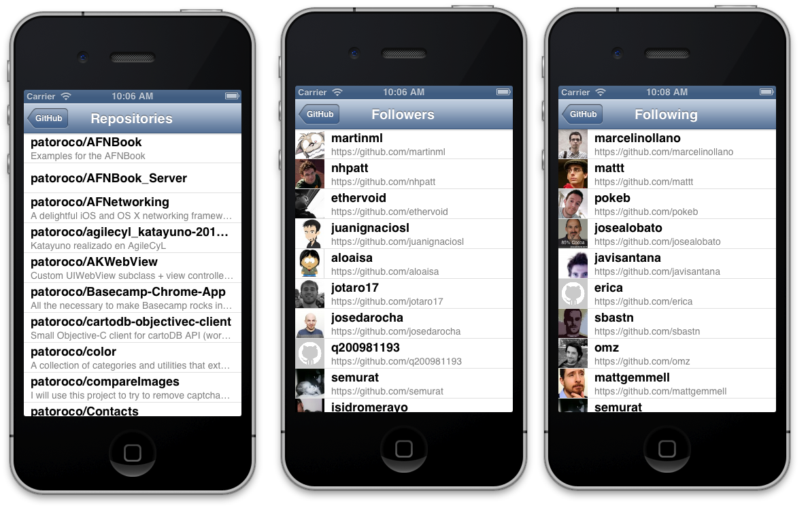

### 4.1.6 Repositories, followers and following  

Next three screens are very similar (being honest, maybe I should share same viewController), so I prefer explain it together.  
  
The main point is show a list of info (repos, followers or followings) related with an user, doing a request to different paths as will explain after. Final result should be similar to below image, so take your time to understand and recreate it with Interface Builder.  
  
  
  
As I told before, lists get their info from different URLs that are:  
  
* users/%@/repos  
* users/%@/followers  
* users/%@/following  
  
We’ll explain in depth followers screen because it’s the most complete (includes image loads), but remember that all source code is available on GitHub, so feel free to use as reference too.  
  
On first place, we need to define two properties, one to save nickname (it’s set from main screen) and another one to store array of followers:  
  
```obj-c  
@interface JMFollowersList : UITableViewController  
	@property (nonatomic, strong) NSString *nickname;  
	@property (nonatomic, retain) NSArray *followers;  
@end  
```  
  
Now in viewDidLoad method do a request to followers relative URL using our APIClient as follows:  
  
```obj-c  
-(void)viewDidLoad{  
    …  
    NSString *path = [NSString stringWithFormat:@"users/%@/followers", self.nickname];  
      
    [[JMGitHubAPIClient sharedClient]  
     getPath:path  
     parameters:nil  
     success:^(AFHTTPRequestOperation *operation, id responseObject) {  
           
         self.followers = responseObject;  
         [self.tableView reloadData];  
           
     } failure:^(AFHTTPRequestOperation *operation, NSError *error) {  
         NSLog(@"ERROR: %@", error.localizedDescription);  
     }];  
}  
```
  
As you can see, that’s trivial: you only do a GET request to specific path, and when success copy JSON results in your array and reload table, so delegate methods will be called:  
  
```obj-c  
#pragma mark - Table Delegates  
-(NSInteger)tableView:(UITableView *)tableView numberOfRowsInSection:(NSInteger)section{  
	return self.followers.count;  
}  
  
- (UITableViewCell *)tableView:(UITableView *)tableView cellForRowAtIndexPath:(NSIndexPath *)indexPath{  
	static NSString *CellIdentifier = @"Identifier";  
  
	UITableViewCell *cell = [tableView dequeueReusableCellWithIdentifier:CellIdentifier];  
  
	if (!cell){  
		cell = [[UITableViewCell alloc] initWithStyle:UITableViewCellStyleSubtitle reuseIdentifier:CellIdentifier];  
	}  
  
	NSDictionary *followersDict = [self.followers objectAtIndex:indexPath.row];  
	[cell.imageView  
		setImageWithURL:[NSURL URLWithString:followersDict[@"avatar_url"]]  
		placeholderImage:[UIImage imageNamed:@"icon.png"]];  
		cell.textLabel.text = followersDict[@"login"];  
		cell.detailTextLabel.text = followersDict[@"html_url"];  
	return cell;  
}  
```  
  
Here you load all info in your cells as is usual, and use UIImageView category included in AFNetworking to load UIImageView easily.  
  
Finally, we’ll create another viewController that only includes a webView, which is loaded with URL (friend GitHub profile in this case) as follows:  
  
```obj-c  
-(void)tableView:(UITableView *)tableView didSelectRowAtIndexPath:(NSIndexPath *)indexPath{  
    [self performSegueWithIdentifier:kWebSegue sender:self];  
}  
  
-(void)prepareForSegue:(UIStoryboardSegue *)segue sender:(id)sender{  
    JMWebView *webView = segue.destinationViewController;  
      
	NSDictionary *followersDict = [self.followers objectAtIndex:self.tableView.indexPathForSelectedRow.row];  
    webView.url = followersDict[@"html_url"];  
}  
```  
  
That’s all; the other two screens are the same thing changing URL of request and fields names gotten from JSON.