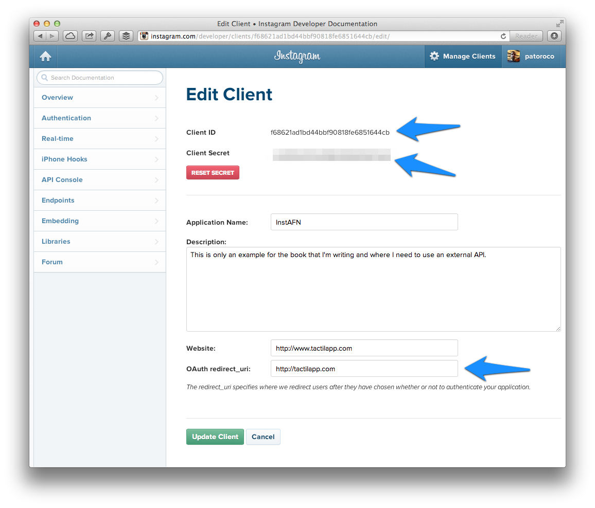

### 4.2.1 Register application  
  
Because we’ll need to log in from our application, first step is request permission to Instagram about our application, so go to [http://instagram.com/developer/](http://instagram.com/developer/) and click on Register Your Application, where you should see a screen as image below:  
  
  
  
Mainly you need to set the name and the description for your application, website, and finally, a redirect URL that will be called after user log in or when access.  
  
For example, when user log in correctly with InstAFN he will be redirect to [http://tactilapp.com/#access_token=&lt;user_token&gt;](http://tactilapp.com/#access_token=&lt;user_token&gt;), so we’ll catch these token to use on the user session, but we’ll explain it later.