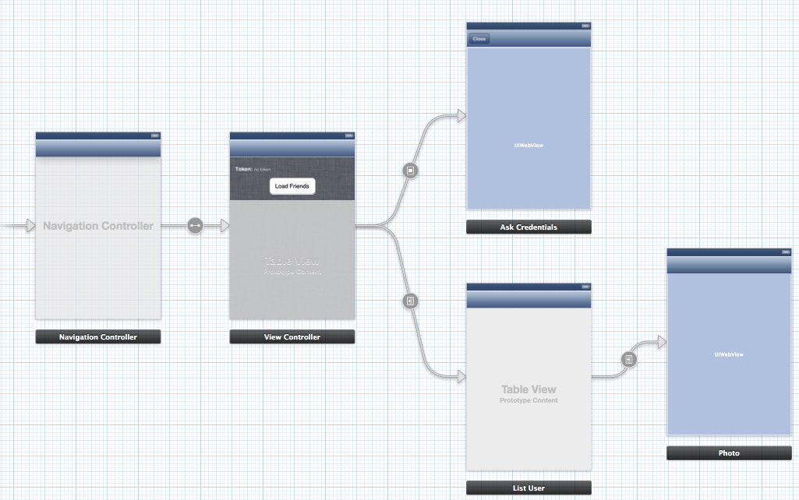

### 4.2.2 Skeleton of InstAFN  
  
This time we’ll use also storyboard to simplify app flow, in this case we have a main view controller with a table inside of it where we’ll show our Instagram fiends, and where user click on one cell, we’ll show all his photos on another table together used filters. Finally, if user clicks one photo, application loads a web view with Instagram webpage for this. You can take image below as guide if you want.  
  
  
  
Maybe now you are asking about ‘Ask Credentials’ view controller, but don’t worry, I didn’t forget it, it’s just I’ll explain it on next subsection. Go ahead!