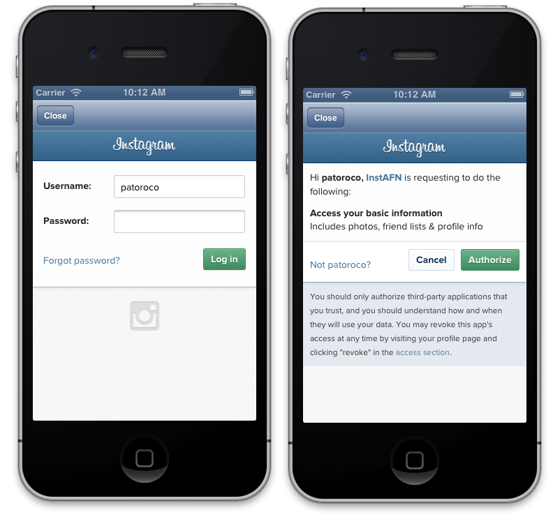

### 4.2.3 Login with OAuth2  
  
Instagram implements *OAuth2*  as authentication system, so first of all we need to ask about a token which will be send on all requests to API if we want to be known as authenticated users.  
  
For this example we’ll define a public property on our AppDelegate where we store our token once loged in as follows.  
  
```obj-c  
@property (nonatomic, strong) NSString *token;  
```  
  
After that we need to create another view controller which will be called always that user try to do any authenticated task without be log in, this is the `Ask Credentials` controller that you see on storyboard figure.  
  
For this purpose, we need to do an authorize request to Instagram oauth server, passing as parameters our client id (you can found it on your Instagram application page) and callback URL (it needs to be the same which you fill on your application page) as follows:  
  
```obj-c  
NSString * const kClientID = @"f68621ad1bd44bbf90818fe6851644cb";  
NSString * const kCallbackURL = @"tactilapp.com";  
  
@interface JMAskCredentials()  
	@property (weak, nonatomic) IBOutlet UIWebView *web;  
@end  
  
@implementation JMAskCredentials  
-(void)viewDidLoad{  
	NSString *oauthURL = @"https://api.instagram.com/oauth/authorize";  
  
	NSString *authURL = [NSString stringWithFormat:@"%@/?client_id=%@&redirect_uri=http://%@&response_type=token", oauthURL, kClientID, kCallbackURL];  
  
	NSURLRequest *req = [NSURLRequest requestWithURL:[NSURL URLWithString:authURL]];  
  
	[self.web loadRequest:req];  
}  
```  
  
This request will retrieve a webpage where user needs to fill his username and password, and if all is correct, allow to our application to access to his basic information as shown in image below.  
  
  
  
When user log in correctly and allow us to access his data, web view will be redirect to our callback URL followed of the access token if all was ok, or with error messages if any failed.  
  
Is for this that we need to watch over all requests in web view using a delegate method of the web view controller. If we found any string with ‘access_token’ in, we set this to AppDelegate property and close this view controller.  
  
```obj-c  
-(BOOL)webView:(UIWebView *)webView shouldStartLoadWithRequest:(NSURLRequest *)request navigationType:(UIWebViewNavigationType)navigationType{  
	if ([request.URL.host isEqualToString:kCallbackURL]  
		&& request.URL.fragment){  
		  
		NSString *anchor = request.URL.fragment;  
		NSRange range = [anchor rangeOfString:@"access_token="];  
  
		if (range.length != 0){  
			NSString *token = [anchor substringFromIndex:range.location + range.length];  
			JMAppDelegate *delegate = [[UIApplication sharedApplication] delegate];  
			delegate.token = token;  
			[self close:self];  
  
			return NO;  
		}  
	}  
	return YES;  
}  
```  
  
At this moment, we’ve stored token, so from now we can add it to our request and we’ll be registered user facing to Instagram.