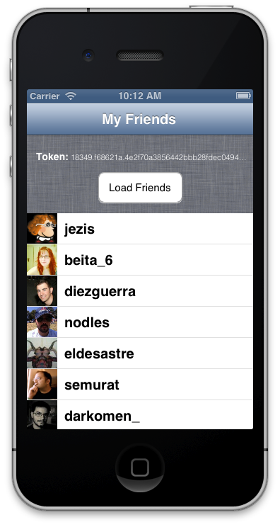

### 4.2.5 Load friends of logged user  

On first screen we’ll include a button to reload friend list. This button monitors the token, and while it doesn’t exist will show credentials screen where user need to log in to continue. When you finish this example, you’ll have some like image below.  
  
  
  
When user has a token, app will do a request using InstagramAPIClient to get friend followers because token is being sent so user is authenticated for Instagram. Code is very similar to that seen in previous chapters as follows, but remember that APIClient is working for you adding token in each request.  
  
```obj-c  
- (IBAction)loadFriends:(id)sender {  
	JMAppDelegate *delegate = [[UIApplication sharedApplication] delegate];  
  
	if (!delegate.token){  
		[self performSegueWithIdentifier:@"askCredencials" sender:self];  
	}else{  
		[[JMInstagramAPIClient sharedClient]  
			getPath:@"users/self/followed-by"  
			parameters:nil  
			success:^(AFHTTPRequestOperation *operation, id responseObject) {  
				self.following = responseObject[@"data"];  
				[self.table reloadData];  
			} failure:^(AFHTTPRequestOperation *operation, NSError *error) {  
				NSLog(@"%@", error);  
			}  
		];  
	}  
}  
```