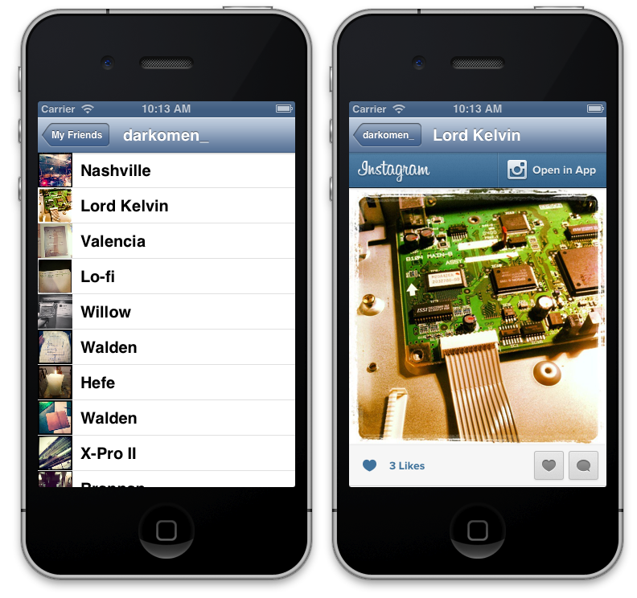

### 4.2.6 Friend’s photos  

When a user is selected between user’s friend list, a new view controller will load all his photos and which filter he used. For this purpose is important to define a property with id of the user because Instagram API will require it, and after that load info as follows.  
  
```obj-c  
-(void)viewDidLoad{  
	[super viewDidLoad];  
	NSString *path = [NSString stringWithFormat:@"users/%@/media/recent", self.idUser];  
	  
	[JMInstagramAPIClient sharedClient] getPath:path  
		parameters:nil  
		success:^(AFHTTPRequestOperation *operation, id responseObject) {  
			self.photos = responseObject[@"data"];  
			[self.table reloadData];  
	} failure:^(AFHTTPRequestOperation *operation, NSError *error) {  
		NSLog(@"%@", error.localizedDescription);  
	}];  
}  
```  
  
As you can see, we always repeat some structure here: request info, load in an array and reload table to show info on screen. Really you should add more stuff to make a killer application, but with respect to consume an API that’s enough to have a final screen as image below.  
  
  
  
On right image above, you see Instagram photo loaded in a web view. You could have load only image into a UIImageView, or animate while you show up, imagination is your limit!