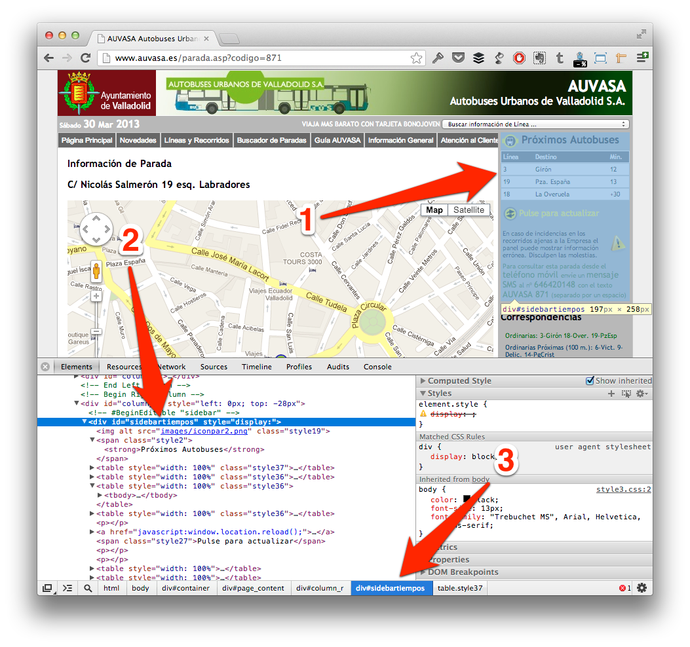

### 5.2.1 Navigate in the structure  
  
When you visit this page, you can see a map on the left to represent where is the stop, and how far to the next bus on the right. We’ll catch these information form our application to show it friendlier on our application.  
  
First of all, I recommend to inspect how is built the website, because after we’ll use a parser to catch these information (and no more), so we need to specify ‘queries’ to the parser. Exist several tools for to do that (Safari Inspector, Firebug for Firefox…), but I like Google Chrome, so we’ll use his web inspector here.  
  
On Google Chrome, you can go to menu View `| Developer | Developer` Tools or press `Cmd + Alt + I`, and you should see any similar to image below.  
  
  
  
If you press on lens icon at the bottom of Chrome, and after select specific website area (this will be grayed, as point 1), you’ll see HTML code which it is (point 2). Point 3 notes HTML hierarchy composed by class and ids, as like different elements which embedded current element.  
  
This notation should be familiar to you if you were working with jQuery or CSS for example, if not, take patience to understand which one is inside of which other.  
  
In this case, you can see that important information is inside of a `div` with id `sidebartiempos`, and after that, each line is a different table with class `style36` that contents three td, first correspond to line number, second is the name and third is the time until bus arrives.  
  
In conclusion, we’ll do queries about #sidebartiempos table.style36 and iterate over td contented in each one to catch different values.  
  
Also we’ll catch coordinates from Google Maps to include a map in our application. For that we’ll search different `<script>` in the source code, and using regular expressions will find longitude and latitude. Don’t worry if this confuses you at this moment, that’s easier when you code with it.