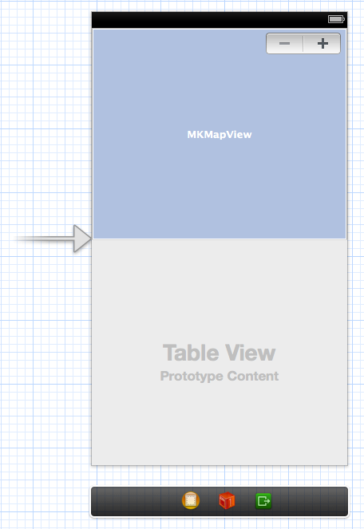

## 5.3 Skeleton of our application  
  
At this time, we’ll work with a single view application compounds by a mapview and a table view, as well as an stepper which will enable us to change between bus stops. Final view should be similar to image below.  
  
  
  
Don’t forget to connect these components with IBOutlets, and define another NSArray property to store arrivals (we will create this class after) as follows:  
  
```obj-c  
#define uBUS @”http://www.auvasa.es/parada.asp”  
  
@interface JMViewController (){  
	int lineNumber;  
}  
  
@property (weak, nonatomic) IBOutlet MKMapView *map;  
@property (weak, nonatomic) IBOutlet UITableView *table;  
@property (weak, nonatomic) IBOutlet UIStepper *stepper;  

@property (nonatomic,strong) NSMutableArray *arrivals;  
@end  
```  
  
You can see a variable named lineNumber that will store which line is selected, to show information about it on screen.