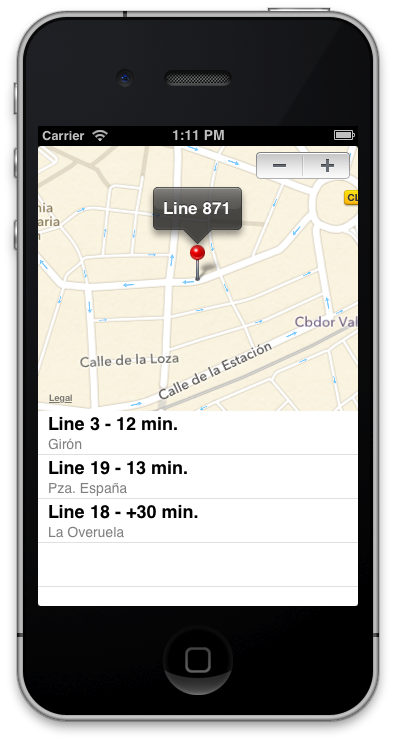

### 5.3.5 Load different lines  
  
Finally, you only need to call the `loadBusLine` method at load application and always that user press stepper to change between line numbers as follows:  
  
```obj-c  
- (void)viewDidLoad{  
	[super viewDidLoad];  
	[self loadBusLine:(int)self.stepper.value];  
}  

- (IBAction)valueChanged:(UIStepper *)sender {  
	[self loadBusLine:(int)sender.value];  
}  
```  
  
If you press `Run` button, you should see any like the image below. You can change bus stops with stepper, and you’ll see arrivals to each stop.  
  
