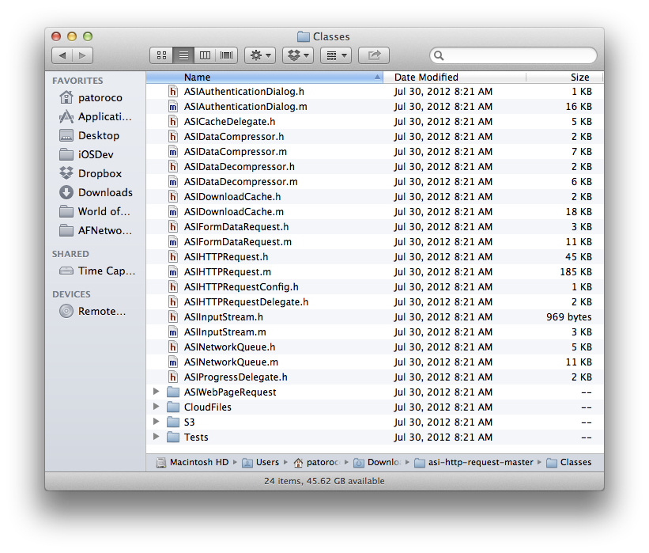
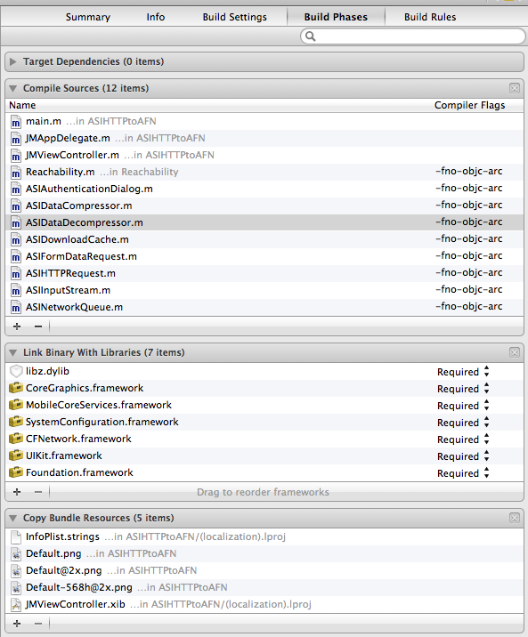

### 6.1.1 Downloading and including ASIHTTPRequest in our project  

First that we need to do is going to `ASIHTTPRequest` project webpage ([http://allseeing-i.com/ASIHTTPRequest/](http://allseeing-i.com/ASIHTTPRequest/)) and download and unzip the code to our computer as see in the following figure.  
  
  
  
You need to include all these files in your project, and if your project is to iOS, also need to add Reachability and `ASIAuthenticationDialog` classes. Anyway, if you are unsure of which files you need to include specifically, you have a complete list of them on [http://allseeing-i.com/ASIHTTPRequest/Setup-instructions](http://allseeing-i.com/ASIHTTPRequest/Setup-instructions).  
  
After that you need to include several frameworks to run an `ASIHTTPRequest` project:  
  
* CFNetwork  
* SystemConfiguration  
* MobileCoreServices  
* CoreGraphics  
* libz  
  
Because you probably are in an ARC compatible project, you need to add some `-fno-objc-arc` flags to your compiler, because these were created without ARC. To do that, open your project file, and in `Build Phases` look for `Compiled Sources` label. A list of files will appear, and you can add some compiler flags at this point as you can see at the following image.  
  
  
  
Try to run the application at this point, and if you receive some error, repeat these steps before to continue.